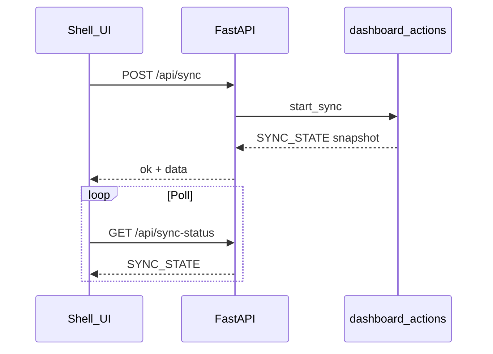

# Shopify Agentic SEO — Technical Documentation

Maintainer-oriented reference: architecture, configuration, SQLite schema, HTTP API, UI activities, and background jobs. Canonical sources are the cited paths; cross-check with FastAPI OpenAPI at `/docs` when in doubt.

---

## Table of contents

1. [Overview](#1-overview)
2. [Architecture](#2-architecture)
3. [API contracts, errors, and streaming](#3-api-contracts-errors-and-streaming)
4. [Configuration and environment](#4-configuration-and-environment)
5. [External integrations](#5-external-integrations)
6. [AI subsystem](#6-ai-subsystem)
7. [Background jobs: sync and AI](#7-background-jobs-sync-and-ai)
8. [Data model (SQLite)](#8-data-model-sqlite)
9. [HTTP API reference](#9-http-api-reference)
10. [Activities by screen](#10-activities-by-screen)
11. [Execution flows (summary)](#11-execution-flows-summary)
12. [Testing and scripts](#12-testing-and-scripts)
13. [Local development](#13-local-development)
14. [Maintainer notes](#14-maintainer-notes)

---

## 1. Overview

**ShopifySEO** is a self-hosted SEO operations app for **Shopify** merchants. It syncs catalog entities (products, collections, pages, blogs/articles) into **SQLite**, enriches them with **Google Search Console**, **GA4**, **URL indexing** metadata, **PageSpeed Insights** (Lighthouse category scores cached per URL), and optional **structured SEO** rollups. It supports **keyword research** (DataForSEO Labs + SERP when configured), **clustering**, **competitor** tracking, **embeddings** (Gemini) for similarity and gap analysis, **AI-assisted** content and meta workflows, **Sidekick** chat on detail views, **article ideas**, and **image SEO** (vision-based alt suggestions and product media optimization).

The **FastAPI** app serves a production **Vite/React** SPA from `frontend/dist` at **`/app/`** (same origin as `/api/...`).

---

## 2. Architecture

| Layer | Technology | Notes |
|--------|------------|--------|
| API | FastAPI — [`backend/app/main.py`](backend/app/main.py) | Routers under `backend/app/routers/` |
| UI | React 18, Vite, Tailwind, TanStack Query — [`frontend/src/`](frontend/src/) | Router basename `/app` — [`frontend/src/app/router.tsx`](frontend/src/app/router.tsx) |
| Charts | Recharts | Overview, Google Signals |
| Domain library | [`shopifyseo/`](shopifyseo/) | Shopify sync, Google clients, AI engine, embeddings, store schema |
| App services | [`backend/app/services/`](backend/app/services/) | Orchestration; delegates to `shopifyseo/` |
| Schemas | [`backend/app/schemas/`](backend/app/schemas/) | Pydantic models for routers |

**Process model:** Catalog/Google **sync** and **AI** jobs run **in-process** (threads), with state exposed via [`shopifyseo/dashboard_actions.py`](shopifyseo/dashboard_actions.py) and HTTP status endpoints.

---

## 3. API contracts, errors, and streaming

### 3.1 Success envelope (majority of routes)

Most JSON endpoints return:

```json
{ "ok": true, "data": { ... } }
```

The React client validates this in [`frontend/src/lib/api.ts`](frontend/src/lib/api.ts) (`getJson` / `postJson` / `patchJson` / `deleteJson`).

### 3.2 Errors

- **`HTTPException`:** [`backend/app/main.py`](backend/app/main.py) maps to `{ "ok": false, "error": { "code": "http_<status>", "message": "<detail>" } }` when `detail` is a string.
- **Validation errors** and non-envelope responses may surface as thrown errors in the client; `formatHttpErrorDetail` parses common shapes.
- **409 Conflict:** used when sync or AI is already running (`/api/sync`, `/api/products/{handle}/generate-ai`, etc.).

### 3.3 Alternate JSON shape (keywords and clusters)

These routes return a **flat** `{ "ok": true, "data": ... }` or `{ "ok": false, "detail": "..." }` **without** wrapping `data` in the `SuccessResponse` helper (still `ok` + `data` at top level). The frontend parses them accordingly.

### 3.4 Server-Sent Events (SSE)

| Endpoint | Purpose |
|----------|---------|
| [`GET /api/ai-stream?job_id=…`](backend/app/routers/ai_stream.py) | Streams AI job events for a running job (`connected`, progress, `done` / `error` / `cancelled`) — see [`frontend/src/hooks/use-ai-stream.ts`](frontend/src/hooks/use-ai-stream.ts) |
| [`POST /api/articles/generate-draft-stream`](backend/app/routers/blogs.py) | New article draft generation stream |
| [`POST /api/keywords/clusters/generate`](backend/app/routers/clusters.py) | Cluster generation: `progress` / `error` / `done` events |
| [`POST /api/keywords/competitors/research`](backend/app/routers/keywords.py) | Competitor research stream |
| [`POST /api/keywords/target/research`](backend/app/routers/keywords.py) | Target keyword research stream |

Event lines use `text/event-stream` (`data: {json}` or named `event:` lines as implemented per router).

---

## 4. Configuration and environment

### 4.1 Database path

| Variable | Purpose |
|----------|---------|
| `SHOPIFY_CATALOG_DB_PATH` | Optional override for the SQLite file (default: repo root `shopify_catalog.sqlite3`) — see [`shopifyseo/shopify_catalog_sync/__init__.py`](shopifyseo/shopify_catalog_sync/__init__.py) |

### 4.2 Settings stored in SQLite (`service_settings`)

Keys loaded/saved through Settings UI and [`shopifyseo/dashboard_config.py`](shopifyseo/dashboard_config.py) **`RUNTIME_SETTING_KEYS`** (values can also be supplied via environment; see `_ENV_MAPPING` for the subset that is mirrored from DB into `os.environ` on startup via `apply_runtime_settings`):

`shopify_shop`, `shopify_api_version`, `shopify_client_id`, `shopify_client_secret`, `dataforseo_api_login`, `dataforseo_api_password`, `moz_api_token`, `google_client_id`, `google_client_secret`, `search_console_site`, `ga4_property_id`, `openai_api_key`, `gemini_api_key`, `anthropic_api_key`, `openrouter_api_key`, `ollama_api_key`, `ollama_base_url`, `ai_generation_provider`, `ai_generation_model`, `ai_sidekick_provider`, `ai_sidekick_model`, `ai_review_provider`, `ai_review_model`, `ai_image_provider`, `ai_image_model`, `ai_vision_provider`, `ai_vision_model`, `ai_prompt_profile`, `ai_prompt_version`, `ai_max_retries`.

[`backend/app/services/settings_service.py`](backend/app/services/settings_service.py) merges **env vs DB** provenance when building the payload for `GET /api/settings`.

### 4.3 Environment variables (operational and goals)

| Variable | Where used | Purpose |
|----------|------------|---------|
| `SHOPIFY_SHOP`, `SHOPIFY_CLIENT_ID`, `SHOPIFY_CLIENT_SECRET`, `SHOPIFY_API_VERSION` | Shopify sync / Admin API | Shop credentials |
| `SHOPIFY_STORE_URL` | [`shopifyseo/dashboard_queries.py`](shopifyseo/dashboard_queries.py) | Optional store URL helper |
| `GOOGLE_CLIENT_ID`, `GOOGLE_CLIENT_SECRET` | Google OAuth | OAuth client |
| `DATAFORSEO_API_LOGIN`, `DATAFORSEO_API_PASSWORD` | Settings / keyword research | DataForSEO (optional) |
| `MOZ_API_TOKEN` | Settings / Moz manual research | Moz (optional) |
| `OPENAI_API_KEY`, `GEMINI_API_KEY`, etc. | AI providers | Same keys as in DB settings |
| `OVERVIEW_GOAL_GSC_DAILY_CLICKS`, `OVERVIEW_GOAL_GSC_DAILY_IMPRESSIONS`, `OVERVIEW_GOAL_GA4_DAILY_SESSIONS`, `OVERVIEW_GOAL_GA4_DAILY_VIEWS` | [`backend/app/services/dashboard_service.py`](backend/app/services/dashboard_service.py) | Optional reference lines on overview charts |
| `DASHBOARD_TZ` | [`backend/app/services/gsc_overview_calendar.py`](backend/app/services/gsc_overview_calendar.py) | Default `America/Vancouver` |
| `GSC_DIMENSIONAL_FETCH` | [`shopifyseo/dashboard_store.py`](shopifyseo/dashboard_store.py) | When truthy, enables dimensional GSC fetch behavior |

### 4.4 Settings UI tabs (mirror for operators)

From [`frontend/src/routes/settings-page.tsx`](frontend/src/routes/settings-page.tsx):

- **Integrations:** provider API keys + Ollama URL; **DataForSEO** login/password; link to validate via `POST /api/keywords/target/validate-dataforseo`.
- **AI Models:** generation, Sidekick, review QA, image generation, vision (alt).
- **Runtime:** `ai_prompt_profile`, `ai_prompt_version`, `ai_max_retries` (timeout is **120s fixed in code**).
- **Data sources:** Shopify shop + API version + client id/secret; Google client id/secret + Search Console site URL + GA4 property id.

---

## 5. External integrations

| Integration | Implementation |
|-------------|----------------|
| **Shopify Admin API** | [`shopifyseo/shopify_catalog_sync/`](shopifyseo/shopify_catalog_sync/), [`shopifyseo/shopify_admin.py`](shopifyseo/shopify_admin.py), [`shopifyseo/shopify_product_media.py`](shopifyseo/shopify_product_media.py) — sync, metafields, articles, media |
| **Google OAuth + GSC + GA4 + Inspection** | [`shopifyseo/dashboard_google.py`](shopifyseo/dashboard_google.py) — tokens in `service_tokens`; cached API payloads in `google_api_cache` |
| **PageSpeed Insights** | Lighthouse JSON via `get_pagespeed` / cache — performance and SEO category scores persisted in `SEO_SIGNAL_COLUMNS` on entities — [`shopifyseo/dashboard_store.py`](shopifyseo/dashboard_store.py) |
| **DataForSEO** | [`backend/app/services/keyword_research/`](backend/app/services/keyword_research/) (Labs + SERP clients), [`backend/app/routers/keywords.py`](backend/app/routers/keywords.py) |
| **Embeddings (Gemini)** | [`shopifyseo/embedding_store.py`](shopifyseo/embedding_store.py) — model `gemini-embedding-2-preview`, dimension **3072** |

### 5.1 Image and theme assets

- [`shopifyseo/product_image_seo.py`](shopifyseo/product_image_seo.py), [`shopifyseo/html_images.py`](shopifyseo/html_images.py), [`shopifyseo/theme_template_images.py`](shopifyseo/theme_template_images.py), [`shopifyseo/shopify_theme_assets.py`](shopifyseo/shopify_theme_assets.py) support catalog/HTML/theme-related image analysis and SEO helpers used from [`backend/app/services/image_seo_service.py`](backend/app/services/image_seo_service.py).

---

## 6. AI subsystem

| Component | Role |
|-----------|------|
| [`shopifyseo/dashboard_ai.py`](shopifyseo/dashboard_ai.py) | Connection tests, configuration gates |
| [`shopifyseo/dashboard_ai_engine.py`](shopifyseo/dashboard_ai_engine.py) | Orchestrates generation / field flows |
| [`shopifyseo/dashboard_ai_engine_parts/providers.py`](shopifyseo/dashboard_ai_engine_parts/providers.py) | Provider-specific HTTP |
| [`shopifyseo/dashboard_ai_engine_parts/prompts.py`](shopifyseo/dashboard_ai_engine_parts/prompts.py), [`context.py`](shopifyseo/dashboard_ai_engine_parts/context.py) | Prompt assembly and RAG-style context (signals, GSC, embeddings) |
| [`shopifyseo/dashboard_ai_engine_parts/generation.py`](shopifyseo/dashboard_ai_engine_parts/generation.py), [`qa.py`](shopifyseo/dashboard_ai_engine_parts/qa.py) | Draft and review passes |
| [`shopifyseo/dashboard_ai_engine_parts/images.py`](shopifyseo/dashboard_ai_engine_parts/images.py) | Image generation / WebP / vision alt |
| [`shopifyseo/sidekick.py`](shopifyseo/sidekick.py) | `run_sidekick_turn` for [`POST /api/sidekick/chat`](backend/app/routers/sidekick.py) |

**UI:** Sidekick posts to `/api/sidekick/chat` from [`frontend/src/components/sidekick/sidekick-context.tsx`](frontend/src/components/sidekick/sidekick-context.tsx).

---

## 7. Background jobs: sync and AI

### 7.1 Sync (`SYNC_STATE`)

Defined in [`shopifyseo/dashboard_actions.py`](shopifyseo/dashboard_actions.py). Exposed as [`GET /api/sync-status`](backend/app/routers/status.py) / [`backend/app/schemas/status.py`](backend/app/schemas/status.py) **`SyncStatusPayload`**.

**Start / stop:** [`POST /api/sync`](backend/app/routers/actions.py) body: `scope` (default `all`), `selected_scopes` (list), `force_refresh`. [`POST /api/sync/stop`](backend/app/routers/actions.py).

**Selectable scopes (UI):** [`frontend/src/components/shell/app-shell.tsx`](frontend/src/components/shell/app-shell.tsx) — `shopify`, `gsc`, `ga4`, `index`, `pagespeed`, `structured`.

**Stage labels (display):** same file — e.g. `syncing_shopify`, `syncing_products`, `syncing_collections`, `syncing_pages`, `syncing_blogs`, `refreshing_gsc`, `refreshing_ga4`, `refreshing_index`, `refreshing_pagespeed`, `updating_structured_seo`, `complete`, `idle`, `starting`.

**Notable counters in payload:** per-entity Shopify progress (`products_*`, `collections_*`, `pages_*`, `blogs_*`, `blog_articles_*`), GSC refresh/skip/error counts, GA4 rows/errors, index refresh/skip/errors, PageSpeed refreshed/rate-limited/skipped/errors/queue fields, `cancel_requested`, `last_error`.

**Throttling / concurrency (code constants in `dashboard_actions.py`):** e.g. `GSC_SYNC_THROTTLE_SECONDS`, `GSC_SYNC_WORKERS`, `INDEX_SYNC_*`, `PAGESPEED_SYNC_*`, `PAGESPEED_RECENT_FETCH_WINDOW_SECONDS`.



### 7.2 AI jobs (`AI_STATE`, `AI_JOBS`)

- **Global state:** `AI_STATE`, per-job map `AI_JOBS`, queues `AI_JOB_QUEUES` in [`shopifyseo/dashboard_actions.py`](shopifyseo/dashboard_actions.py).
- **Status:** [`GET /api/ai-status?job_id=…`](backend/app/routers/status.py) → [`AiStatusPayload`](backend/app/schemas/status.py) (`running`, `stage`, `steps`, `last_error`, …).
- **Cancel:** [`POST /api/ai-stop`](backend/app/routers/status.py) body `{ "job_id": "..." }`.
- **Field regeneration:** synchronous suggestion via `POST .../regenerate-field` (returns proposed content); background apply via `POST .../regenerate-field/start` (returns `job_id` / state) — used on product, collection, page, and article detail pages.

---

## 8. Data model (SQLite)

Single file (see §4.1). Schema = **Shopify catalog tables** + **dashboard extensions** + **Google cache**.

### 8.1 Catalog core ([`shopifyseo/shopify_catalog_sync/db.py`](shopifyseo/shopify_catalog_sync/db.py))

Tables include: `sync_runs`, `products`, `product_variants`, `product_images`, `product_metafields`, `collections`, `collection_metafields`, `pages`, `blogs`, `blog_articles`, `collection_products`, `shopify_metaobjects`.

### 8.2 Dashboard extensions ([`shopifyseo/dashboard_store.py`](shopifyseo/dashboard_store.py) `ensure_dashboard_schema`)

**New tables:** `seo_workflow_states`, `service_tokens`, `service_settings`, `clusters`, `cluster_keywords`, `gsc_query_rows`, `gsc_query_dimension_rows`, `seo_recommendations`, `keyword_metrics`, `keyword_research_runs` (legacy installs may still have `ahrefs_research_runs` until schema init runs once), `keyword_page_map`, `competitor_keyword_gaps`, `competitor_profiles`, `competitor_top_pages`, `article_ideas`, `embeddings`.

**Columns added** to `products`, `collections`, `pages`, `blog_articles` (`SEO_SIGNAL_COLUMNS`):  
`gsc_clicks`, `gsc_impressions`, `gsc_ctr`, `gsc_position`, `gsc_last_fetched_at`, `ga4_sessions`, `ga4_views`, `ga4_avg_session_duration`, `ga4_last_fetched_at`, `index_status`, `index_coverage`, `google_canonical`, `index_last_fetched_at`, `pagespeed_performance`, `pagespeed_seo`, `pagespeed_status`, `pagespeed_last_fetched_at`, `seo_signal_updated_at`.

### 8.3 Google API cache ([`shopifyseo/dashboard_google.py`](shopifyseo/dashboard_google.py) `ensure_google_cache_schema`)

**Table:** `google_api_cache` — `cache_key`, `cache_type`, `object_type`, `object_handle`, `url`, `strategy`, `payload_json`, `fetched_at`, `expires_at`, `updated_at`; indexes on `cache_type` and `url`.

### 8.4 Embeddable entity types ([`shopifyseo/embedding_store.py`](shopifyseo/embedding_store.py))

`product`, `collection`, `page`, `blog_article`, `cluster`, `gsc_queries`, `keyword`, `article_idea`, `competitor_page`.

---

## 9. HTTP API reference

**`GscPeriodMode`** (query on many detail/list endpoints): `mtd` | `full_months` | `since_2026_02_15` | `rolling_30d` — [`backend/app/schemas/dashboard.py`](backend/app/schemas/dashboard.py).

### 9.1 Auth

| Method | Path | Notes |
|--------|------|--------|
| GET | `/auth/google/start` | OAuth start |
| GET | `/auth/google/callback` | OAuth callback |

### 9.2 Dashboard

| Method | Path | Query / body | Response schema |
|--------|------|----------------|-----------------|
| GET | `/api/summary` | `gsc_period`, `gsc_segment` | [`DashboardSummary`](backend/app/schemas/dashboard.py) |

### 9.3 Actions and status

| Method | Path | Body | Response |
|--------|------|------|----------|
| POST | `/api/sync` | `SyncStartPayload`: `scope`, `selected_scopes`, `force_refresh` | `SyncStatusPayload` |
| POST | `/api/sync/stop` | — | `SyncStatusPayload` |
| GET | `/api/sync-status` | — | `SyncStatusPayload` |
| GET | `/api/ai-status` | `job_id` | `AiStatusPayload` |
| POST | `/api/ai-stop` | `{ job_id }` | `AiStatusPayload` |

### 9.4 Products (`/api/products`)

| Method | Path | Query / body |
|--------|------|----------------|
| GET | `/api/products` | `query`, `sort`, `direction`, `limit`, `offset`, `focus` (`missing_meta` \| `thin_body`) |
| GET | `/api/products/{handle}` | `gsc_period` |
| POST | `/api/products/{handle}/refresh` | `ProductRefreshRequest`, `gsc_period` |
| POST | `/api/products/{handle}/generate-ai` | — |
| POST | `/api/products/{handle}/regenerate-field` | `FieldRegenerateRequest` |
| POST | `/api/products/{handle}/regenerate-field/start` | `FieldRegenerateRequest` |
| POST | `/api/products/{handle}/update` | `ProductUpdatePayload`, `gsc_period` |
| POST | `/api/products/{handle}/inspection-link` | — |

Schemas: [`backend/app/schemas/product.py`](backend/app/schemas/product.py).

### 9.5 Collections and pages (`/api`)

| Method | Path | Query / body |
|--------|------|----------------|
| GET | `/api/collections` | Same list params as products; `focus=missing_meta` only |
| GET | `/api/pages` | Same |
| GET | `/api/collections/{handle}` | `gsc_period` |
| GET | `/api/pages/{handle}` | `gsc_period` |
| POST | `/api/collections/{handle}/update` | `ContentUpdatePayload`, `gsc_period` |
| POST | `/api/pages/{handle}/update` | same |
| POST | `/api/collections/{handle}/inspection-link` | — |
| POST | `/api/pages/{handle}/inspection-link` | — |
| POST | `/api/collections/{handle}/refresh` | optional JSON `step`, `gsc_period` |
| POST | `/api/pages/{handle}/refresh` | same |
| POST | `/api/collections/{handle}/generate-ai` | — |
| POST | `/api/pages/{handle}/generate-ai` | — |
| POST | `/api/collections/{handle}/regenerate-field` | `FieldRegenerateRequest` |
| POST | `/api/pages/{handle}/regenerate-field` | same |
| POST | `/api/collections/{handle}/regenerate-field/start` | same |
| POST | `/api/pages/{handle}/regenerate-field/start` | same |
| POST | `/api/collections/save-meta` | bulk meta save payload (service) |
| POST | `/api/pages/save-meta` | same |

Schemas: [`backend/app/schemas/content.py`](backend/app/schemas/content.py).

### 9.6 Blogs and articles (`/api`)

| Method | Path | Notes |
|--------|------|--------|
| GET | `/api/articles` | All articles list |
| GET | `/api/articles/{blog_handle}/{article_handle}` | `gsc_period` |
| POST | `/api/articles/{blog_handle}/{article_handle}/update` | `ContentUpdatePayload`, `gsc_period` |
| POST | `/api/articles/{blog_handle}/{article_handle}/inspection-link` | — |
| POST | `/api/articles/{blog_handle}/{article_handle}/refresh` | optional `step`, `gsc_period` |
| POST | `/api/articles/{blog_handle}/{article_handle}/generate-ai` | — |
| POST | `/api/articles/{blog_handle}/{article_handle}/regenerate-field` | `FieldRegenerateRequest` |
| POST | `/api/articles/{blog_handle}/{article_handle}/regenerate-field/start` | same |
| GET | `/api/blogs` | Blog list |
| GET | `/api/blogs/shopify-ids` | Blog id map |
| GET | `/api/blogs/{blog_handle}/articles` | Articles in blog |
| POST | `/api/articles/generate-draft` | `ArticleGenerateDraftRequest` |
| POST | `/api/articles/generate-draft-stream` | SSE stream |
| POST | `/api/articles/create` | `ArticleCreateRequest` |

Schemas: [`backend/app/schemas/blog.py`](backend/app/schemas/blog.py).

### 9.7 Keywords (`/api/keywords`)

| Method | Path | Notes |
|--------|------|--------|
| GET/POST | `/api/keywords/seed` | List / save seeds |
| POST | `/api/keywords/seed/generate` | AI seed generation |
| DELETE | `/api/keywords/seed/{keyword}` | |
| GET | `/api/keywords/competitors` | |
| GET | `/api/keywords/competitors/{domain}/detail` | Path domain |
| POST | `/api/keywords/competitors` | Add competitor |
| POST | `/api/keywords/competitors/research` | SSE |
| DELETE | `/api/keywords/competitors/{domain}` | |
| GET | `/api/keywords/target` | |
| POST | `/api/keywords/target/research` | SSE |
| POST | `/api/keywords/target/validate-dataforseo` | Returns `{ ok, detail }` |
| POST | `/api/keywords/target/gsc-crossref` | |
| PATCH | `/api/keywords/target/bulk-status` | `BulkStatusRequest` |
| PATCH | `/api/keywords/target/{keyword}/status` | `KeywordStatusRequest` |

### 9.8 Clusters (`/api/keywords/clusters`)

| Method | Path | Notes |
|--------|------|--------|
| GET | `/api/keywords/clusters` | Returns `{ ok, data }` |
| POST | `/api/keywords/clusters/generate` | SSE |
| GET | `/api/keywords/clusters/match-options` | |
| GET | `/api/keywords/clusters/{cluster_id}/detail` | |
| PATCH | `/api/keywords/clusters/match` | `MatchUpdateBody` |

### 9.9 Article ideas (`/api/article-ideas`)

| Method | Path |
|--------|------|
| GET | `/api/article-ideas` |
| POST | `/api/article-ideas/generate` |
| DELETE | `/api/article-ideas/{idea_id}` |
| PATCH | `/api/article-ideas/{idea_id}/approve` |
| PATCH | `/api/article-ideas/{idea_id}/status` | `UpdateIdeaStatusRequest` |

### 9.10 Embeddings (`/api/embeddings`)

| Method | Path | Query |
|--------|------|--------|
| GET | `/api/embeddings/status` | |
| POST | `/api/embeddings/refresh` | Background full sync |
| GET | `/api/embeddings/similar/{object_type}/{handle}` | `top_k` (1–20) |
| GET | `/api/embeddings/semantic-keywords/{object_type}/{handle}` | `top_k` (1–30) |
| GET | `/api/embeddings/competitive-gaps/{object_type}/{handle}` | `top_k` (1–20) |
| GET | `/api/embeddings/cannibalization` | `threshold` (0.5–1.0) |

**Note:** The SPA currently calls **status** and **refresh** only; other endpoints are API-ready for tools or future UI.

### 9.11 Image SEO (`/api/image-seo`)

| Method | Path | Query / body |
|--------|------|----------------|
| GET | `/api/image-seo/product-images` | `limit`, `offset`, `missing_alt`, `weak_filename`, `product_query`, `resource_type`, `sort`, `direction` |
| POST | `/api/image-seo/product-images/sync-from-shopify` | |
| POST | `/api/image-seo/suggest-alt` | `ImageSeoSuggestAltRequest` |
| POST | `/api/image-seo/product-images/draft` | `ProductImageSeoDraftRequest` |
| POST | `/api/image-seo/product-images/optimize` | `ProductImageSeoOptimizeRequest` |

### 9.12 Google Signals and settings (`/api`)

| Method | Path |
|--------|------|
| GET | `/api/google-signals` |
| POST | `/api/google-signals/site` |
| POST | `/api/google-signals/refresh` |
| GET | `/api/settings` |
| POST | `/api/settings` |
| POST | `/api/settings/ai-test` |
| POST | `/api/settings/image-model-test` |
| POST | `/api/settings/ollama-models` |
| POST | `/api/settings/anthropic-models` |
| POST | `/api/settings/gemini-models` |
| POST | `/api/settings/openrouter-models` |

Payload types: [`backend/app/schemas/operations.py`](backend/app/schemas/operations.py).

### 9.13 Sidekick and AI stream

| Method | Path |
|--------|------|
| POST | `/api/sidekick/chat` |
| GET | `/api/ai-stream` | `job_id` (required) |

---

## 10. Activities by screen

Paths are under **`/app`** (basename). Shell: sync start/stop, scope toggles, `GET /api/sync-status` — [`frontend/src/components/shell/app-shell.tsx`](frontend/src/components/shell/app-shell.tsx).

| Screen | Route | User activities | APIs (representative) |
|--------|-------|-----------------|------------------------|
| Overview | `/` | GSC period/segment, charts, top pages | `GET /api/summary?gsc_period=&gsc_segment=` |
| Products | `/products` | Search, sort, focus missing meta / thin body, pagination | `GET /api/products?...` |
| Product detail | `/products/:handle` | Edit fields, save, refresh signals, inspection link, full AI generate, field regen + job poll, Sidekick, `ai-stream`, stop AI | `/api/products/{handle}/*`, `/api/ai-status`, `/api/ai-stop`, `/api/ai-stream`, `/api/sidekick/chat` |
| Collections list | `/collections` | Search, sort, focus, bulk save meta | `GET /api/collections?...`, `POST /api/collections/save-meta` |
| Collection detail | `/collections/:handle` | Same pattern as product (no Sidekick binding unless shell provides) | `/api/collections/{handle}/*`, AI status/stop |
| Pages list | `/pages` | Same as collections | `GET /api/pages?...`, `POST /api/pages/save-meta` |
| Page detail | `/pages/:handle` | Same as collection detail | `/api/pages/{handle}/*` |
| Blogs | `/blogs` | List blogs | `GET /api/blogs` |
| Blog articles | `/blogs/:blogHandle` | List articles | `GET /api/blogs/{blog}/articles` |
| Articles hub | `/articles` | Cross-blog list, Shopify id hints | `GET /api/articles`, `GET /api/blogs/shopify-ids` |
| Article detail | `/articles/:blogHandle/:articleHandle` | Edit, refresh, inspection, AI, field regen, stream, stop | `/api/articles/.../*`, `/api/ai-status`, `/api/ai-stop` |
| Keywords | `/keywords` | Tabs: seeds (load/save/generate), competitors (add/delete/research SSE), targets (research SSE, GSC crossref, bulk/single status) | `/api/keywords/*` (see §9.7) |
| Cluster detail | `/keywords/clusters/:id` | View cluster detail, target keyword context | `GET /api/keywords/clusters/{id}/detail`, `GET /api/keywords/target` |
| Competitor detail | `/keywords/competitors/:domain` | Competitor breakdown | `GET /api/keywords/competitors/{domain}/detail` |
| Article ideas | `/article-ideas` | Generate, filter by status, delete, approve (PATCH), blog mapping | `/api/article-ideas/*`, `/api/blogs/shopify-ids` |
| Google Signals | `/google-signals` | Select site/property, refresh breakdowns | `GET /api/google-signals`, `POST /api/google-signals/site`, `POST /api/google-signals/refresh` |
| Embeddings | `/embeddings` | View coverage, refresh all | `GET /api/embeddings/status`, `POST /api/embeddings/refresh` |
| Image SEO | `/image-seo` | Filter list, sync from Shopify, suggest alt, draft optimize, optimize | `/api/image-seo/*` |
| Settings | `/settings` | Save all keys, AI test (generation/review/sidekick), image model test, fetch model lists | `/api/settings*`, `POST /api/keywords/target/validate-dataforseo` |

**Clusters panel** (embedded in Keywords): `GET/POST/PATCH` cluster endpoints + SSE generate — [`frontend/src/routes/keywords/ClustersPanel.tsx`](frontend/src/routes/keywords/ClustersPanel.tsx).

---

## 11. Execution flows (summary)

1. **Ingest:** Shopify Admin API → SQLite (`shopify_catalog_sync`); optional CLI [`python -m shopifyseo.shopify_catalog_sync`](shopifyseo/shopify_catalog_sync/__init__.py).
2. **Sync job:** `POST /api/sync` → refresh Shopify slice then GSC / GA4 / index / PageSpeed / structured per scope.
3. **Read dashboards:** Summary and lists read SQLite + `google_api_cache` / computed rollups.
4. **AI:** Detail actions → `dashboard_ai_engine` → optional SSE; writes back to Shopify or local rows.
5. **Keywords:** DataForSEO (seed + competitor pipelines) + GSC cross-reference + embeddings for clusters/targets.
6. **Embeddings:** Gemini batch embed → `embeddings` table; similarity/gap queries optional via API.

---

## 12. Testing and scripts

### 12.1 Pytest (`tests/`)

| File | Focus |
|------|--------|
| `test_api.py` | API-level behavior |
| `test_catalog_completion.py` | Catalog completion metrics |
| `test_embedding_store.py` | Embeddings |
| `test_keyword_research.py`, `test_keyword_clustering.py` | Keywords / clusters |
| `test_indexing_rollup.py`, `test_index_inspection_targets.py` | Indexing |
| `test_gsc_*` | GSC overview, segments, cache keys, property breakdown |
| `test_phase3_gsc_ai_context.py` | GSC in AI context |
| `test_article_idea_*` | Article ideas lifecycle |
| `test_article_image_webp.py`, `test_article_body_image_inject.py` | Article images |
| `test_product_image_seo.py`, `test_blog_image_seo_filename_alt.py` | Product/blog image SEO |
| `test_html_images.py`, `test_theme_template_images.py` | HTML / theme images |
| `test_seo_slug.py`, `test_seo_clamp.py` | SEO utilities |

### 12.2 Frontend

Vitest: `*.test.tsx` co-located (e.g. [`frontend/src/routes/settings-page.test.tsx`](frontend/src/routes/settings-page.test.tsx)).

### 12.3 Scripts

[`scripts/test_gemini_vision.py`](scripts/test_gemini_vision.py) — ad-hoc Gemini vision check.

---

## 13. Local development

- **SPA build:** `cd frontend && npm run build` (use `npm run rebuild` if Vite cache is stale).
- **API:** from repo root: `PYTHONPATH=. uvicorn backend.app.main:app --reload --host 127.0.0.1 --port 8000`.
- **Open:** `http://127.0.0.1:8000/app/` (hard refresh after deploy). See [AGENTS.md](AGENTS.md).

---

## 14. Maintainer notes

- **OpenAPI:** `http://127.0.0.1:8000/docs` — authoritative for parameter names; this doc adds behavioral context.
- **Stray merge artifacts:** files matching `*.sync-conflict-*` under `backend/` or `frontend/` are **not** registered in [`backend/app/main.py`](backend/app/main.py); remove or resolve in git — do not treat as live routes.
- **Generated artifacts:** `node_modules/`, `frontend/dist/`, SQLite `-wal`/`-shm` files are environment outputs, not source-of-truth documentation targets.

---

*Document expanded for full activity coverage. Update this file when adding routers, tables, or settings keys.*
