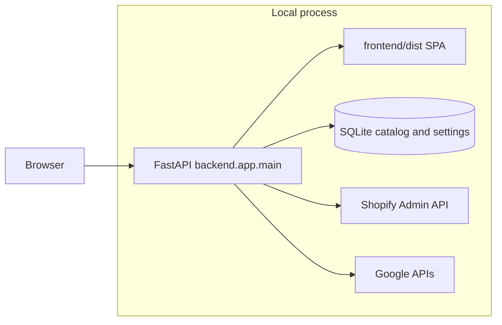

# Architecture overview

ShopifySEO is a **self-hosted** SEO operations app: a **FastAPI** backend serves a **React** single-page app and exposes JSON APIs. Business logic lives primarily in the **`shopifyseo`** Python package; **`backend/app`** wires HTTP routes, Pydantic schemas, and thin service facades.

## Runtime layout

- **SQLite** — Default database file (e.g. catalog, embeddings, cached metrics, service settings). Paths are defined in application code (see `shopifyseo/dashboard_store.py` and related modules).
- **Frontend** — Vite + React + TypeScript. Production assets are built into `frontend/dist` and served by FastAPI; contributors often use `http://127.0.0.1:8000/app/` with a fresh build after UI changes (see [AGENTS.md](../AGENTS.md)).
- **`shopifyseo/`** — Sync pipelines, AI engine, Google integrations, keyword research, Shopify Admin GraphQL usage, etc.
- **`backend/app/`** — Routers under `routers/`, schemas under `schemas/`, orchestration under `services/`.

## Request flow (typical)

1. Browser loads the SPA from `/app/`.
2. API calls go to `/api/...` (see routers in `backend/app/routers/`).
3. Services open a DB connection, read settings (including credentials mirrored from env where applicable), and call into `shopifyseo` modules.

## Further reading

- [TECHNICAL_DOC.md](../TECHNICAL_DOC.md) — deeper technical reference when present in the tree
- [CONTRIBUTING.md](../CONTRIBUTING.md) — dev setup and PR expectations
- [AGENTS.md](../AGENTS.md) — maintainer/agent workflow for building and testing locally
