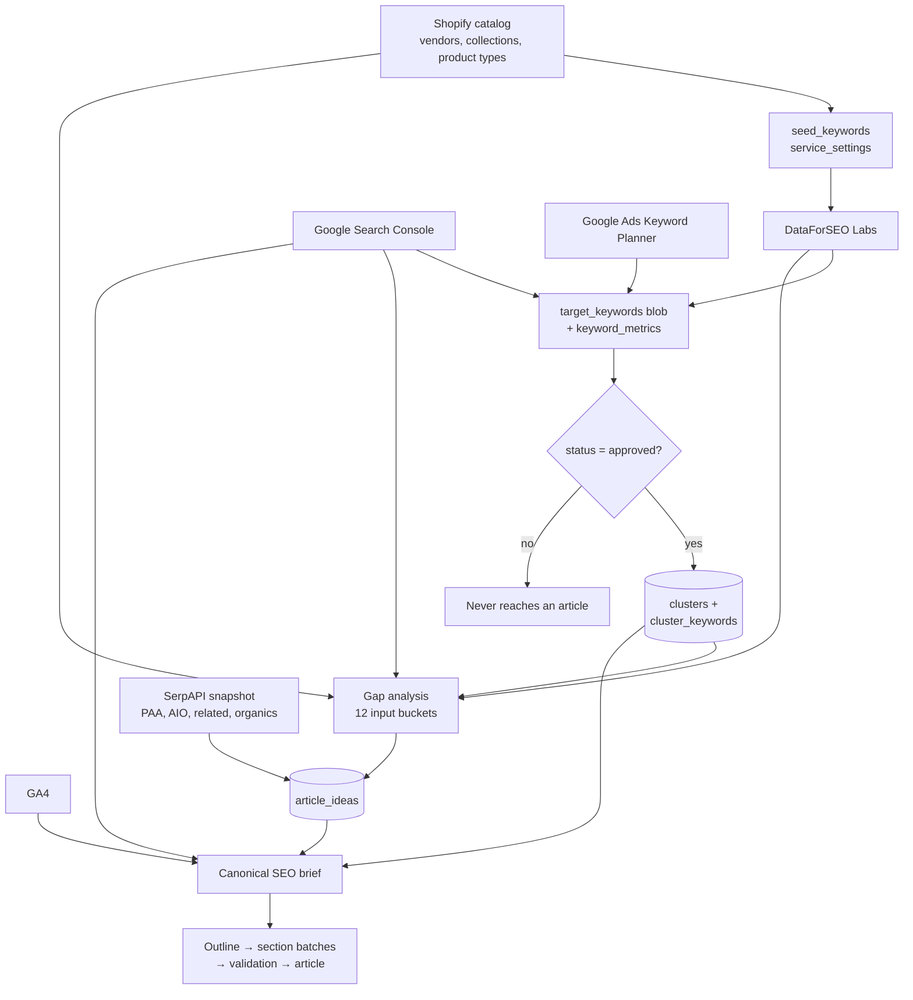

# Article Draft Data Pipeline

Traces every data point that decides **what an article draft is about** and **which keywords go into it** — from seed keyword generation through to the saved Shopify draft.

Written to answer one question: *given a drafted article, where did its title and each of its keywords come from, and why?*

Scope: the `article_ideas` → `generate-draft-stream` path. Sibling flows (product/collection/page AI generation, Sidekick) reuse some of the same context builders but are out of scope here.

**Companion docs:** [TECHNICAL_DOC.md](../TECHNICAL_DOC.md) for routes/tables/services inventory; [seo-database-blueprint.md](seo-database-blueprint.md) for the stored-column index.

---

## Contents

| Part | Stage | Primary code |
|---|---|---|
| [1](#part-1--seed-keyword-generation) | Seed keyword generation | `backend/app/routers/keywords.py` |
| [2](#part-2--keyword-research-dataforseo) | Keyword research (DataForSEO) | `backend/app/services/keyword_research/` |
| [3](#part-3--signal-enrichment-gsc-ga4-google-ads) | Signal enrichment (GSC, GA4, Ads) | `keyword_research/keyword_db.py` |
| [4](#part-4--approve--dismiss-the-first-hard-gate) | Approve / dismiss | `keyword_research/keyword_db.py` |
| [5](#part-5--clustering) | Clustering | `backend/app/services/keyword_clustering/` |
| [6](#part-6--article-idea-generation) | Article idea generation | `shopifyseo/dashboard_article_ideas.py`, `_article_ideas.py` |
| [7](#part-7--idea--draft-request) | Idea → draft request | `frontend/src/routes/idea-detail-page.tsx`, `routers/blogs.py` |
| [8](#part-8--draft-context-assembly-and-generation) | Draft context assembly + generation | `dashboard_ai_engine_parts/_article_draft.py` |
| [9](#part-9--what-is-guaranteed-to-appear-in-the-article) | Compliance gates | `article_draft_compliance.py` |
| [10](#part-10--persistence-and-audit-trail) | Persistence / audit trail | `dashboard_store.py` |

---

## Pipeline overview

---

## Part 1 — Seed keyword generation

**Entry point:** `POST /api/keywords/seed/generate` → [`generate_seed_keywords`](../backend/app/routers/keywords.py#L108)

No AI. Pure catalog SQL against the synced Shopify data.

| Source | Query / rule | Emitted seeds |
|---|---|---|
| Brands | `SELECT DISTINCT vendor FROM products WHERE vendor != ''` | `{vendor}`, `{vendor} vape`, `{vendor} disposable vape` |
| Collections | `SELECT title, handle FROM collections`, skipping `frontpage`, `deals`, `new-arrivals`, `accessories`, `coils` | collection title |
| Product types | `SELECT DISTINCT product_type`, last segment after the final `>` in the taxonomy path | that segment |
| Industry | 10 hardcoded terms interpolated with the market country name ([keywords.py:158](../backend/app/routers/keywords.py#L158)) | e.g. `disposable vape {country}`, `best disposable vape`, `nicotine salt vape` |

Deduplicated case-insensitively. Existing seeds (including manually added ones) are merged in and preserved.

**Storage:** JSON array in `service_settings.seed_keywords`, each entry `{keyword, source}` where `source` ∈ `brand` / `collection` / `product_type` / `industry` / manual.

**Also editable via:** `GET/POST /api/keywords/seed`, `DELETE /api/keywords/seed/{keyword}`.

> ⚠️ **Store-specific hardcoding.** The industry seed list and the `{vendor} vape` / `{vendor} disposable vape` expansions are vape-specific and baked into every install. They are not derived from the catalog, `store_description`, or any setting.

---

## Part 2 — Keyword research (DataForSEO)

Two independent pipelines write into the same target keyword store.

### 2a. Seed research

`POST /api/keywords/target/research` → [`run_seed_keyword_research`](../backend/app/services/keyword_research/research_runner.py#L349)

Seeds are batched 5 at a time ([`batch_seeds`](../backend/app/services/keyword_research/keyword_utils.py#L354)); all calls filter `max_difficulty=70` and use the primary market's location/language codes.

| DataForSEO endpoint | Purpose | `source_endpoint` tag |
|---|---|---|
| `keyword_suggestions` (Labs) | phrase-match expansions | `keywords_explorer` |
| `google_autocomplete` (**SERP API**, not Labs) | autocomplete strings, then enriched for volume/difficulty via a second `keyword_ideas` call | `keywords_explorer` |
| `keyword_ideas` (Labs) | related ideas (200 seeds per chunk) | `keywords_explorer` |

### 2b. Competitor research

`POST /api/keywords/competitors/research` → [`run_competitor_research`](../backend/app/services/keyword_research/research_runner.py#L424)

| Endpoint | Purpose | Writes to |
|---|---|---|
| `serp_competitors` | discover domains ranking for your seeds | auto-merged into `competitor_domains` when run as part of full competitor research; the separate `/discover-from-seed` endpoint is the actual pending-review flow |
| `bulk_traffic_estimation` | full-domain organic ETV | `competitor_profiles.traffic` |
| `ranked_keywords` (per domain) | keywords the competitor ranks for | keyword rows tagged `site_explorer` with `competitor_domain`, `competitor_position`, `competitor_url` |
| `relevant_pages` (per domain) | their top pages by traffic | `competitor_top_pages` |

Competitor domains pass through a blocklist (`competitor_blocklist.py`) — rejecting a suggestion or removing a competitor persists the domain so it is never re-suggested.

### Fields DataForSEO returns per keyword

[`_keyword_data_block_to_explorer_row`](../backend/app/services/keyword_research/dataforseo_client.py#L223)

| Stored field | DataForSEO source |
|---|---|
| `volume` | `keyword_info.search_volume` |
| `difficulty` | `keyword_properties.keyword_difficulty` — **`0` normalized to `NULL`** ([`_normalize_keyword_difficulty`](../backend/app/services/keyword_research/dataforseo_client.py#L204)) |
| `cpc` | `keyword_info.cpc` |
| `intents` | `search_intent_info.main_intent` + `foreign_intent` |
| `serp_features` | `serp_info.serp_item_types` → `{type: 1}` counts |
| `parent_topic` | `keyword_properties.core_keyword` (legacy column name) |
| `serp_last_update` | `serp_info.last_updated_time` |
| `traffic_potential` | volume, unless an override is supplied |

### Derived at ingest

[`_finalize_keyword_research`](../backend/app/services/keyword_research/research_runner.py#L270) — dedupe (highest volume wins, seed sets and SERP features merged), then per keyword:

| Derived field | Logic |
|---|---|
| `intent` + `content_type` | [`classify_intent`](../backend/app/services/keyword_research/keyword_utils.py#L274) — first match in priority order `transactional > commercial > local > informational > navigational > branded`; defaults to `informational` |
| `content_format_hint` | [`derive_content_format_hint`](../backend/app/services/keyword_research/keyword_utils.py#L27) — highest-count SERP feature mapped via `SERP_FORMAT_MAP` (`featured_snippet`→`direct_answer`, `people_also_ask`→`faq`, `video`→`video_embed`, `shopping`→`product_page`, `image_pack`→`visual_guide`, …) |
| `is_local` | `intent_raw.local` or `intent_raw.is_local` |
| `status` | `"new"` |
| `opportunity` | see below |

### Opportunity score

[`compute_opportunity`](../backend/app/services/keyword_research/keyword_utils.py#L192) — `OPPORTUNITY_SCORING_VERSION = 4` (constant lives in `keyword_db.py:17`)

| Weight | Component |
|---|---|
| 0.35 | log-scaled volume (reference 10,000) |
| 0.20 | log-scaled traffic potential |
| 0.15 | ranking status — `quick_win` 100, `striking_distance` 85, `low_visibility` 65, `not_ranking` 55, `ranking` 45 |
| 0.10 | intent — transactional 100, commercial 95, local 90, informational 70, branded 50, navigational 35 |
| 0.20 | difficulty ease (`100 − KD`) — **omitted entirely when KD is unknown**, remaining weights renormalized |

Raw scores are then percentile-normalized to 0–100 across the whole set ([`normalize_opportunity_scores`](../backend/app/services/keyword_research/keyword_utils.py#L243)) — cap is 100 if max ≤ 100, else the 95th percentile.

### Fan-out after research

`service_settings.target_keywords` is the write source of truth. After each run it fans out to:

- `keyword_metrics` — [`sync_keyword_metrics_to_db`](../backend/app/services/keyword_research/keyword_db.py#L168)
- `keyword_page_map` — [`sync_keyword_page_map`](../backend/app/services/keyword_research/keyword_db.py#L277), built from `gsc_query_rows`
- `competitor_keyword_gaps` — [`sync_competitor_keyword_gaps`](../backend/app/services/keyword_research/keyword_db.py#L311)
- `competitor_top_pages` — from keyword metrics, 50 per domain
- embeddings for `keyword` and `competitor_page` object types

---

## Part 3 — Signal enrichment (GSC, GA4, Google Ads)

### GSC cross-reference

`POST /api/keywords/target/gsc-crossref` → [`cross_reference_gsc`](../backend/app/services/keyword_research/keyword_db.py#L659)

Aggregates `gsc_query_rows` by `LOWER(query)` → `{position: MIN, clicks: SUM, impressions: SUM}`, then matches each target keyword with [`match_gsc_queries`](../backend/app/services/keyword_research/keyword_utils.py#L61):

1. Exact match, else
2. **Containment** — stop words stripped from both sides; all content words of the shorter phrase must be a subset of the longer, and the shorter must have ≥2 content words. (The ≥2 rule prevents `thc vape juice` matching `elfbar vape canada` on the shared token `vape`.)

Writes `gsc_position` (best), `gsc_clicks` (total), `gsc_impressions` (total), and `ranking_status` via [`classify_ranking_status`](../backend/app/services/keyword_research/keyword_utils.py#L49):

| Position | Status |
|---|---|
| ≤ 10 | `ranking` |
| ≤ 20 | `quick_win` |
| ≤ 50 | `striking_distance` |
| > 50 | `low_visibility` |
| none | `not_ranking` |

Opportunity is recomputed afterwards, so GSC data directly changes keyword priority everywhere downstream.

### Google Ads Keyword Planner

[`refresh_google_ads_planner_metrics`](../backend/app/services/keyword_research/google_ads_planner_metrics.py) writes `ads_avg_monthly_searches`, `ads_competition`, `ads_competition_index` only. It does **not** update `parent_topic` — only a DataForSEO refresh does.

### GA4

GA4 does not touch keywords. It surfaces later, in two places only: `collection_gaps` (`ga4_sessions`) during gap analysis, and the regeneration performance snapshot (Part 8).

---

## Part 4 — Approve / dismiss (the first hard gate)

Statuses: `new` / `approved` / `dismissed`.

**Routes:** `PATCH /api/keywords/target/{keyword}/status`, `PATCH /api/keywords/target/bulk-status` → [`update_keyword_status`](../backend/app/services/keyword_research/keyword_db.py#L130) / [`bulk_update_status`](../backend/app/services/keyword_research/keyword_db.py#L149). Both write the JSON blob **and** `keyword_metrics` in the same call.

Two consequences:

1. **Metric refresh only touches approved keywords** — [`refresh_target_keyword_metrics`](../backend/app/services/keyword_research/research_runner.py#L596) raises if none are approved (check at L621), and only sends approved keywords to `keyword_overview`.
2. **Clustering only reads approved keywords** — [`load_approved_keywords`](../backend/app/services/keyword_research/keyword_db.py#L101) is `SELECT * FROM keyword_metrics WHERE status = 'approved'`.

**A dismissed or never-approved keyword can never reach an article.** Everything from Part 5 onward inherits this filter.

Status is preserved across re-runs: [`merge_with_existing`](../backend/app/services/keyword_research/keyword_utils.py#L337) copies the existing status onto freshly researched rows.

---

## Part 5 — Clustering

**Route:** `POST /api/keywords/clusters/generate` (SSE) → [`generate_clusters`](../backend/app/services/keyword_clustering/_generation.py#L311)

### Steps

1. **Refresh scores, load approved keywords.** Raises if none approved.
2. **Collapse near-duplicates** — [`collapse_near_duplicates`](../backend/app/services/keyword_clustering/_dedupe.py) uses keyword embeddings to fold variants into canonical + alias map, shrinking the LLM payload. Aliases are re-expanded into the cluster afterwards.
3. **Entity/intent guardrails** — [`partition_keywords_for_generation`](../backend/app/services/keyword_clustering/_planning.py#L391). Entity rules are built from Shopify vendors + collection titles + alias variants ([`load_entity_rules`](../backend/app/services/keyword_clustering/_planning.py#L192)). Competing brands stay in separate partitions unless the keyword carries a comparison signal ([`_has_comparison_signal`](../backend/app/services/keyword_clustering/_planning.py#L265)).
4. **Pre-cluster** — partitions >60 keywords go through embedding `pre_cluster` at threshold 0.82.
5. **LLM per bucket** — up to 4 in parallel. Schema `CLUSTERING_SCHEMA`: `{name, content_type, primary_keyword, content_brief, keywords}`. `content_type` ∈ `collection_page` / `product_page` / `blog_post` / `buying_guide` / `landing_page`. Prompt payload per keyword ([`_build_clustering_prompt`](../backend/app/services/keyword_clustering/_helpers.py#L141)): keyword, volume, difficulty, opportunity, intent, content_type, ranking_status, plus optional cps / format_hint / serp.
6. **Deterministic re-scoring** — the model's `primary_keyword` is overridden by [`select_primary_keyword`](../backend/app/services/keyword_clustering/_scoring.py#L125). Per-keyword score (`_primary_keyword_score`, `_scoring.py#L96`): `0.45×opportunity + 0.25×centrality (cosine to cluster embedding centroid, lexical Jaccard fallback) + 0.15×log-scaled volume + 0.10×content-type↔intent fit + 0.05×ai_bonus (matches the LLM's originally suggested primary_keyword)`.
7. **Aggregate stats** — [`_compute_cluster_stats`](../backend/app/services/keyword_clustering/_helpers.py#L81): `total_volume`, `avg_difficulty` (unknowns excluded), `avg_opportunity`, `avg_cps`, `dominant_serp_features` (top 3), `content_format_hints` (top 2).
8. **Post-process** — merge cos-similar clusters, fold singletons, then [`repair_and_enrich_clusters`](../backend/app/services/keyword_clustering/_planning.py#L780) splits clusters where `size > max_size` OR `_has_mixed_entities` (mixed brand/product entities, not intent directly — `_planning.py#L796`) OR `quality_score < 68.0`, and writes the planning columns.
9. **Page matching** — a second LLM call maps each cluster to an existing `collection` / `page` / `blog_article`, or `new`. Result stored as `match_type` / `match_handle` / `match_title`. **This becomes the article's primary internal link target.**
10. **Save** — `DELETE FROM clusters` (cascades), then re-insert. Clusters are fully regenerated each run; ids change.

### Planning columns written to `clusters`

| Column | Meaning |
|---|---|
| `detected_entity` | brand/product entity detected from vendors + collections; used as the article's E-E-A-T anchor |
| `cluster_intent` | dominant keyword intent |
| `cluster_role` | e.g. `brand_collection`, `comparison`, `buying_guide`, `troubleshooting`, `faq`, `local`, `generic` |
| `quality_score` | cluster coherence; multiplies priority |
| `cannibalization_risk` | `high` (≥3 distinct pages present in `keyword_page_map` for these keywords, position not considered), `medium` (2, position not considered), `low` (1 page, and only counts if ranked ≤ pos 20), `none` — [`_cannibalization_risk`](../backend/app/services/keyword_clustering/_planning.py#L545) |
| `core_keywords_json` / `supporting_keywords_json` / `extended_keywords_json` | tiers from [`keyword_tiers`](../backend/app/services/keyword_clustering/_planning.py#L602) |
| `priority_score` | cluster ordering (distinct from `avg_opportunity`) |

**Tier ranking** ([`_keyword_sort_score`](../backend/app/services/keyword_clustering/_planning.py#L591)): `opportunity + 12 (if quick_win/striking_distance) + 25 (if cluster primary) + 5 (if competitor data)`, tie-broken by log(volume) then shorter keyword.

**Priority adjustments** ([`enrich_cluster_for_content`](../backend/app/services/keyword_clustering/_planning.py#L669)): `× (0.65 + quality_score/200)`, `× 0.82` if cannibalization high, `× 0.90` if medium, `+ 3.0` if any keyword has competitor data.

> ⚠️ **Store-specific hardcoding.** The clustering system prompt opens with `"You are an SEO content strategist for a {country_name} online vape store"` ([_helpers.py:145](../backend/app/services/keyword_clustering/_helpers.py#L145)), and its worked example is `'Elf Bar Disposable Vapes'`.

---

## Part 6 — Article idea generation

**Route:** `POST /api/article-ideas/generate` → [`generate_article_ideas`](../shopifyseo/dashboard_ai_engine_parts/_article_ideas.py#L251)

### 6a. Gap analysis inputs

[`fetch_article_idea_inputs`](../shopifyseo/dashboard_article_ideas.py#L146) — 12 buckets:

| # | Bucket | Rule | Source |
|---|---|---|---|
| 1 | `cluster_gaps` | Top 12 clusters with `content_type IN ('blog_post','buying_guide')` and **no** `blog_articles` row whose `title`/`seo_title`/`body` contains the primary keyword. Each enriched with top 8 keywords by opportunity (top 5 only when the cluster has no parsed `core_keywords`/`supporting_keywords` tiers — legacy clusters), tiers, coverage ratio vs the matched page's content, and `existing_page` (best-ranking page from `keyword_page_map`). **Only the first 10 of these 12 clusters are re-sorted and rendered into the idea-generation prompt** (`_article_ideas.py:295`, `cluster_candidates[:10]`); all 12 remain available for post-processing / `_best_cluster_for_idea` matching | clusters + keyword_metrics + keyword_page_map |
| 2 | `collection_gaps` | Collections with `gsc_impressions > 200` and no article mentioning the title/handle. Limit 8 | **GSC** |
| 3 | `informational_query_gaps` | `gsc_query_rows` on product/collection/page objects where the query starts with how/best/top/what/why/guide/review, or contains `vs`/`difference`/the market country name — and no article title matches. Limit 15 | **GSC** |
| 4 | `existing_article_titles` | Last 30 by `published_at` — negative examples | Shopify catalog |
| 5 | `top_collections` | Top 10 by impressions — internal-link candidates | **GSC** |
| 6 | `competitor_gaps` | `competitor_keyword_gaps` with informational intent and `volume > 50`, top 40 by volume, **deduped against all cluster-gap keywords**, capped at 10. Skip count reported to the prompt | **DataForSEO** |
| 7 | `competitor_winning_content` | Top 15 `competitor_top_pages` by estimated traffic | **DataForSEO** |
| 8 | `vendor_context` | Top 8 vendors by product count | Shopify catalog |
| 9 | `top_organic_articles` | Top 5 articles by `gsc_clicks` — proven categories | **GSC** |
| 10 | `top_countries` + `device_split` | `gsc_query_dimension_rows` | **GSC** |
| 11 | `rejected_ideas` | Last 20 rejected idea titles + keywords — negative examples | app state |
| 12 | `queued_keywords` | Primary keywords of ideas in `idea`/`approved`/`published`, last 50 — dedupe guard | app state |

If `cluster_gaps` is empty, [`_fallback_article_clusters`](../shopifyseo/dashboard_ai_engine_parts/_article_ideas.py#L172) loads the top 12 blog/buying-guide clusters regardless of coverage.

### 6b. RAG enhancements

All optional, wrapped in try/except ([_article_ideas.py:481](../shopifyseo/dashboard_ai_engine_parts/_article_ideas.py#L481)):

| Section | Logic |
|---|---|
| Semantic content gaps | Cluster embedding vs all article embeddings; max cosine < 0.6 → flagged as a "true content gap" (highest priority in the prompt) |
| Existing idea topics | Non-rejected idea titles, to avoid overlap |
| Semantically related keywords | `find_semantic_keyword_matches` per top-5 cluster |
| Competitor content signals | `find_competitive_gaps` per top-5 cluster |

### 6c. Cluster ordering before the prompt

[`_cluster_sort_key`](../shopifyseo/dashboard_ai_engine_parts/_article_ideas.py#L278), descending:

1. coverage gap % (`1 − found/total`)
2. `has_ranking_opportunity` (any quick-win or striking-distance keyword)
3. `priority_score × quality_factor × risk_multiplier` — risk multipliers: high 0.72, medium 0.86, low 0.95
4. `total_volume`

### 6d. The prompt

Context block sections, in order: keyword cluster gaps → competitor keyword gaps → competitor winning content → collection gaps → informational query gaps → top vendor brands → proven content categories → audience geography & device → existing articles → rejected ideas → queued ideas → top collections for internal links → RAG sections.

Per-keyword badges the model is taught to read:

| Badge | Meaning |
|---|---|
| `⚡ QUICK WIN pos:N` | ranking 11–20 |
| `📈 STRIKING DIST pos:N` | ranking 21–50 |
| `✅ RANKING pos:N` | top 10 |
| `🆕 EMERGING` | `first_seen` within 90 days |
| `💰 HIGH CPC` | CPC ≥ $1.00 |
| `tp:N` | traffic potential (ETV) at #1 — the model is told to use this, not raw volume, for traffic estimates |
| `top-page-words:N` | avg word count of top-ranking pages — depth benchmark |
| `global-vol:N` | shown only when global volume > 3× local |

**Output:** exactly 5 ideas (`minItems`/`maxItems` 5), each with `suggested_title` (20–70 chars), `brief` (≥80 chars), `primary_keyword`, `supporting_keywords`, `search_intent`, `content_format` (`how_to`/`buying_guide`/`listicle`/`faq`/`comparison`/`review`), `estimated_monthly_traffic`, `linked_cluster_id`, `linked_cluster_name`, `linked_collection_handle`, `linked_collection_title`, `source_type` (`cluster_gap`/`competitor_gap`/`collection_gap`/`query_gap`), `gap_reason`.

### 6e. Post-processing — the model's numbers are discarded

[_article_ideas.py:761](../shopifyseo/dashboard_ai_engine_parts/_article_ideas.py#L761)

| Field | How it is actually set |
|---|---|
| `linked_cluster_id` | [`_best_cluster_for_idea`](../shopifyseo/dashboard_ai_engine_parts/_article_ideas.py#L85) — uses the model's id if it is a real cluster; otherwise picks the best cluster by [`_cluster_match_score`](../shopifyseo/dashboard_ai_engine_parts/_article_ideas.py#L40), a weighted keyword-overlap score across the idea's title, brief, primary and supporting keywords |
| `total_volume`, `avg_difficulty`, `opportunity_score`, `dominant_serp_features`, `content_format_hints` | **Snapshotted from the cluster row, not the AI.** Legacy rows without `priority_score` get `avg_opportunity × 1.5` when the cluster has a ranking opportunity |
| `linked_keywords_json` | [`_cluster_keywords_snapshot`](../shopifyseo/dashboard_ai_engine_parts/_article_ideas.py#L108) — up to 18 cluster keywords with volume, difficulty, ranking_status, gsc_position, opportunity |
| `primary_target` / `secondary_targets` | [`resolve_idea_targets`](../shopifyseo/dashboard_article_ideas.py#L743) — see below |

**Interlink target resolution** ([`resolve_idea_targets`](../shopifyseo/dashboard_article_ideas.py#L743)):

- **Primary** (authority page), in priority order: cluster `match_type`/`match_handle` → `existing_page` (best-ranking page for the primary keyword from `keyword_page_map`) → `linked_collection_handle`. Tagged with `source` = `cluster_match` / `existing_page` / `linked_collection`.
- **Secondary** (up to 3 at idea generation): for each cluster keyword in order (primary first, then top keywords), the best-ranking page from `keyword_page_map`. Each carries an `anchor_keyword` so the drafter can write proper SEO anchor text. Deduped against the primary.

### 6f. SerpAPI enrichment

[`enrich_article_ideas_with_audience_questions`](../shopifyseo/audience_questions_api.py#L949) — one `engine=google` search per idea's primary keyword, before save:

| Stored field | Content |
|---|---|
| `audience_questions_json` | People Also Ask, `[{question, snippet}]`, cap 80 |
| `top_ranking_pages_json` | organic results `[{title, url}]`, cap 20 |
| `ai_overview_json` | text blocks + references |
| `related_searches_json` | `[{query, position}]`, cap 40 |
| `paa_expansion_json` | PAA parent→children tree — **empty at generation** (`expand_paa=False`); populated only by the manual refresh |

Manual re-fetch: `POST /api/article-ideas/{id}/refresh-serp` → [`refresh_article_idea_serp_snapshot`](../shopifyseo/dashboard_article_ideas.py#L1166), which calls with `expand_paa=True` and adds `engine=google_related_questions` expansion.

### 6g. Idea statuses

`idea` (default on save) / `approved` / `published` / `rejected` — `PATCH /{id}/status`, `/{id}/approve`, `/bulk-status`.

Rejection is not just a delete: rejected titles feed bucket 11 of the next gap analysis as negative examples, and queued keywords feed bucket 12. Idea targets are editable while status is `idea` or `approved` (`PATCH /{id}/targets`), validated against the store internal-link allowlist so no invented URL can reach the drafter.

---

## Part 7 — Idea → draft request

**UI:** [`openDraftModal`](../frontend/src/routes/idea-detail-page.tsx#L428)

| Request field | Value | Editable? |
|---|---|---|
| `topic` | **`idea.suggested_title`** — this is the article's subject | yes, in the modal |
| `keywords` | **`[idea.primary_keyword, ...idea.supporting_keywords]`** joined by `", "`, re-split on submit | yes |
| `slug_hint` | derived from title + keywords | yes |
| `author_name` | defaults to the store name | yes |
| `idea_id` | the idea | no |
| `blog_id` / `blog_handle` | target blog (auto-filled when only one exists) | yes |
| `angle_label` | optional, for multiple articles from one idea | yes |
| `resume_run_id` | set only when resuming a failed run | no |

Everything else is re-derived server-side from `idea_id` — the frontend sends no cluster, SERP, or link data.

**Server-side load** ([`_run_generate_article_draft`](../backend/app/routers/blogs.py#L259)) — one wide `SELECT` from `article_ideas` yields:

- `linked_cluster_id` (→ cluster context), `linked_cluster_name`, `linked_collection_handle/title`
- scoring: `total_volume`, `avg_difficulty`, `opportunity_score`, `estimated_monthly_traffic`, `search_intent`
- `primary_target_*` + `secondary_targets_json`
- all five SERP JSON columns → [`parse_idea_serp_row_from_db`](../shopifyseo/dashboard_ai_engine_parts/serp_draft_context.py#L574)
- `linked_keywords_json`, `content_format`, `source_type`, `suggested_title`, `brief`, `gap_reason`

Additional server-side lookups:

| Lookup | Fallback rule |
|---|---|
| Cluster id | If absent and regenerating, `_first_matched_cluster_id_for_blog_article` |
| Primary target | If the idea has none, the cluster's own `match_type`/`match_handle` |
| Sibling articles | Up to 12 articles linked to other ideas in the same cluster, excluding this one |
| Regeneration context | Only when `regenerate_article_handle` is set — see Part 8 |
| Keywords | On regeneration with no keywords supplied, loaded from `article_target_keywords` |

---

## Part 8 — Draft context assembly and generation

[`generate_article_draft`](../shopifyseo/dashboard_ai_engine_parts/_article_draft.py#L80)

### 8a. Prompt blocks

Assembled in this order into a shared grounding string used by every phase:

| Block | Content | Source |
|---|---|---|
| `topic` | the article subject | request |
| `_cluster_brief_section` | cluster name, `cluster_role` ("article role in cluster"), `cluster_intent`, `detected_entity` as E-E-A-T centrepiece, cannibalization warning (fires whenever risk is not `none`/`low`/empty — i.e. `medium`/`high` given the current value domain, `_article_draft.py#L376`), `content_brief` (trimmed to 1200 chars) | `clusters` |
| `_cluster_kw_table_section` | up to 30 keywords ordered by `opportunity DESC NULLS LAST`, each with vol / KD / intent / status / pos / gsc_clicks / gsc_impressions / tp / serp / opp / format. Prefixes: `⭐` = has GSC clicks and not already top-10 (never drop on regen), `★` = quick-win/striking-distance, `-` = other. Framed as a *coverage checklist* | `cluster_keywords ⋈ keyword_metrics` |
| `_cluster_siblings_section` | up to 10 sibling articles as `/blogs/{blog}/{article}` — prioritized for interlinking over RAG matches | `idea_articles` |
| `_idea_meta_section` | total_volume, avg KD, opportunity, est. traffic, intent → converted into a **depth directive** (≥10,000 = comprehensive long-form; ≥1,000 = deep on a focused angle; else tight long-tail) and an **intent framing directive** (commercial → lead with the buying decision; informational → lead with the direct answer; navigational → make the destination unambiguous) | `article_ideas` |
| `_linked_kw_section` | up to 15 idea-level keywords sorted by opportunity, `★` for quick-win/striking-distance | `linked_keywords_json` |
| `_structural_section` | `content_format` → a concrete structure spec (buying guide / comparison / how-to / listicle / review / faq / guide); `source_type` → an angle spec (competitor_gap / collection_gap / query_gap / cluster_gap) | `article_ideas` |
| `_regeneration_section` | existing title, meta title/description, GSC position, GSC+GA4 performance with a **rewrite stance** (≥100 clicks or ≥200 GA4 sessions → "expand carefully, do NOT delete proven copy"; else "rebuild aggressively"), top 25 ranking queries, current h2/h3 outline, 3,500-char visible-text excerpt | `blog_articles` + `gsc_query_rows` |
| `keyword_section` | **first 5** keywords from the request, with vol/KD/format hint | request |
| `_seo_gap_section` | [`compute_seo_gaps`](../backend/app/services/keyword_clustering/_gaps.py#L22) — cluster keywords **not** present in the target content, ranked by `opportunity + 20 (quick-win/striking-distance boost)`, primary keyword forced to position 1, capped at 8 | clusters + keyword_metrics |
| `_rag_reference_block` | 5 store objects — see 8b | embeddings + catalog |
| `seo_brief_block` | the canonical brief JSON — see 8c | all of the above |
| `_serp_user_block` | the SERP appendix — see 8d | SerpAPI |
| `_authority_link_block` | required primary authority URL + each secondary URL with its `anchor_keyword` | idea targets |
| `_collection_link_block` | full store internal-link allowlist as JSON + `title` attribute templates | catalog |

Brand/market context is injected at the **system** level: store name, `store_description` (brand voice, trimmed to 600 chars), author byline (switches Article JSON-LD `author` from `Organization` to `Person`), country name, spelling variant, shipping/availability phrasing, language region code.

### 8b. RAG retrieval

[`run_article_draft_rag`](../shopifyseo/article_draft_retrieval.py#L344) — requires a Gemini API key, otherwise skipped silently.

1. Build a rich query: topic + up to 24 keywords + cluster name/primary_keyword/content_brief + **SERP retrieval-boost terms** (primary keyword, up to 10 related searches, up to 5 PAA question stems)
2. Wide embedding retrieval (`top_k=15`) over `blog_article` / `product` / `collection`
3. Hybrid re-rank: `score + 0.15 × token_overlap`, plus strong token-only catalog rows the embeddings missed (min overlap 2, 8 per type)
4. Return top 5

RAG hits do two things: they appear as "Reference content from your store" for context, and they float to the top of the internal-link allowlist so the model prefers topically relevant destinations.

### 8c. Canonical SEO brief

[_article_draft.py:1613](../shopifyseo/dashboard_ai_engine_parts/_article_draft.py#L1613) — a single JSON object, truncated to 18,000 chars, injected into **every** phase (outline, each section batch, repair). Persisted to `article_draft_runs.seo_brief_json`.

Keys: `topic`, `intent`, `request`, `manual_target_keywords`, `idea_meta`, `idea_keywords`, `cluster` (id, meta, keywords, keyword_metrics, sibling_articles), `target_keyword_metrics` (up to 40 matching rows from the target blob), `seo_gap_keywords`, `regeneration`, `serp`, `internal_links`, `store_references`, `market`, `brand_voice`, `required_coverage`.

`required_coverage` is the contract the validator enforces: `primary_keyword`, `required_keywords_in_body`, `keywords` (up to 60 signal keywords), `faq_questions`, `related_searches`, `primary_link`, `secondary_links`, `information_gain`, `body_length_min`, `body_length_target`.

**`all_signal_keywords`** — the union feeding `required_coverage.keywords`, assembled in this precedence order ([_article_draft.py:1562](../shopifyseo/dashboard_ai_engine_parts/_article_draft.py#L1562)): idea SERP primary → idea supporting → manual (request) → cluster primary → cluster keywords → idea linked keywords → SEO gap keywords.

### 8d. SERP appendix

[`build_serp_appendix_and_retrieval_boost`](../shopifyseo/dashboard_ai_engine_parts/serp_draft_context.py#L320) — budget 7,200 chars, sections dropped from the end when over.

| Section | Cap | Treatment |
|---|---|---|
| Idea anchors | — | primary keyword, brief, gap reason, working title, dominant SERP features, format hints — each dropped if redundant with the topic/keyword corpus |
| People Also Ask | 18 questions, 280-char snippets | "cover in H2/H3 where natural"; snippets flagged non-authoritative |
| PAA hierarchy | 6 parents × 3 children | parents = section intent, children = depth inside that section |
| Related searches tier 1–3 | 12 | **each must get a matching H2/H3** — enforced by the validator |
| Related searches position 4+ | 8 | supporting long-tail, weave in |
| Top ranking titles | 14 | titles only, **no URLs** — differentiation set |
| AI overview | 14 bullets, 2,200 chars | "commodity-coverage radar only, do not mirror" |

`paa_shown_count` from this function sets the FAQPage JSON-LD pair target (`min(6, visible PAA)`).

### 8e. Generation phases

Phased path ([`_try_phased`](../shopifyseo/dashboard_ai_engine_parts/_article_draft.py#L2234)), 11 tracked steps emitted over SSE:

1. **prepare_brief** — build and persist the canonical SEO brief
2. **outline** — one LLM call returning `title`, `seo_title`, `seo_description`, and **8–14 sections** each with `heading`, `level` (h2/h3), `beats` (30–1,600 chars). Rejected if outside 8–14 or any section lacks a heading/level/useful beats
3. **write_sections** — work items = intro + each section, batched **3 at a time**. Each batch receives the shared grounding + locked outline + **article memory** (what has shipped so far) + **remaining required coverage** (what is still missing). The final batch is told to append FAQPage and Article JSON-LD
4. **FAQ/schema** — server-rendered FAQ answers and JSON-LD where the model under-delivered
5. **validation repair** — targeted retries against compliance gaps (Part 9)
6. **content_checkpoint** — body persisted so a failed run can resume
7. **images** — featured 16:9 → 1600×900 WebP, inline 3:2 → 1200×800 WebP, with SEO filenames and generated alt text
8. **insert_body_images** (`blogs.py`, step_index 8, not separately named in earlier drafts of this doc)
9. **shopify** — Shopify create/update
10. **attach_featured_image**
11. **local_save** — includes keyword persistence (`_persist_article_locally` calls `save_article_target_keywords` in the same step). No separate "redirect" step or URL-redirect logic exists anywhere in this pipeline; the earlier "redirect" entry was incorrect.

A single-shot path with retries exists as a fallback ([`_single_shot_with_retries`](../shopifyseo/dashboard_ai_engine_parts/_article_draft.py#L2195)).

**Link sanitization:** [`sanitize_article_internal_links`](../shopifyseo/dashboard_ai_engine_parts/_article_draft.py#L19) rewrites any storefront `<a href>` to the canonical allowlist URL by path, and strips anything that does not resolve. Invented URLs never survive.

---

## Part 9 — What is guaranteed to appear in the article

[`validate_article_draft_compliance`](../shopifyseo/dashboard_ai_engine_parts/article_draft_compliance.py#L449) returns human-readable gaps that drive repair loops. **Hard-gated:**

| Gate | Rule |
|---|---|
| Required keywords | The idea's `primary_keyword` **and** the first keyword from the request must each appear in body text ([_article_draft.py:1143](../shopifyseo/dashboard_ai_engine_parts/_article_draft.py#L1143)). Long keywords fall back to a first-N-chars substring check |
| Tier 1–3 related searches | Each position-1–3 related search must appear in an H2/H3/H4 or paragraph (light paraphrase allowed) |
| Secondary links | Every secondary target URL must appear verbatim as an `<a href>` |
| FAQPage JSON-LD | Required when the topic is FAQ-style or any PAA exists; every schema `Question.name` must match visible on-page wording |
| Internal link count | At least N approved storefront links surviving sanitization |
| Body length | `len(body)` ≥ `MIN_ARTICLE_BODY_HTML_CHARS`; prompts aim higher by `COMPLIANCE_BODY_LENGTH_RETRY_MARGIN` |

**Steered but not enforced:** the cluster keyword table, SEO gap keywords, tier-4+ related searches, PAA coverage beyond the FAQ pair target, AI overview angles, RAG references, and the depth/intent/format directives.

So for any drafted article: two keywords are *guaranteed*, tier-1 related searches are *guaranteed as headings*, and everything else is prioritized guidance whose adoption depends on the model.

---

## Part 10 — Persistence and audit trail

| Table | What it records |
|---|---|
| `article_draft_runs` | The full audit trail for one draft: request payload, **`seo_brief_json`** (every signal that shaped the draft), outline, article memory, checkpoints, body, images, Shopify id/handle, validation summary, status/error. Read via `GET /api/articles/draft-runs/{run_id}` |
| `idea_articles` | N:M idea ↔ article, with `angle_label` for multi-angle drafts |
| `article_target_keywords` | The idea's primary + supporting keywords copied at draft time with `source='idea'`, lowercased, `is_primary` flagged — [`save_article_target_keywords`](../shopifyseo/dashboard_article_ideas.py#L1367). This is what the article keyword-coverage report measures against |
| `blog_articles` | The article itself + denormalized GSC/GA4/index/PageSpeed signals |

**To answer "why does this draft say what it says", read `article_draft_runs.seo_brief_json` for that run.** It is the complete, versioned input snapshot.

---

## Known issues and inconsistencies

| # | Issue | Location |
|---|---|---|
| 1 | **Vape-specific hardcoding in generic paths.** The industry seed list, the `{vendor} vape` seed expansions, and the clustering system prompt (`"…for a {country} online vape store"`, example `'Elf Bar Disposable Vapes'`) are baked in, not derived from the catalog or `store_description` | [keywords.py:129,158](../backend/app/routers/keywords.py#L129), [_helpers.py:145](../backend/app/services/keyword_clustering/_helpers.py#L145) |
| 2 | **Unknown KD leaks as `KD:0` into the idea prompt — on *both* paths, not just one.** `TECHNICAL_DOC.md` forbids `COALESCE(difficulty, 0)`. Competitor-gap rows use `int(r[3] or 0)` then render `KD:{difficulty}` unconditionally ([_article_ideas.py:422](../shopifyseo/dashboard_ai_engine_parts/_article_ideas.py#L422), competitor_gap_lines) and [dashboard_article_ideas.py:508](../shopifyseo/dashboard_article_ideas.py#L508). The **cluster** keyword render in the same idea-generation prompt ([_article_ideas.py:367](../shopifyseo/dashboard_ai_engine_parts/_article_ideas.py#L367), `top_keywords` loop) is *also* unconditional — no truthiness guard, unlike the neighboring `cpc_str`/`cpc_badge` fields which are guarded. The truthiness-guarded pattern does exist, but only at **draft time** in a different file/prompt: [_article_draft.py:559-560](../shopifyseo/dashboard_ai_engine_parts/_article_draft.py#L559) (`_cluster_kw_table_section`). So the idea-generation prompt (Part 6d) leaks `KD:0` on every keyword path, unguarded; only the later draft-context prompt (Part 8a) is safe | see citations above |
| 3 | **Only 5 request keywords reach the visible keyword block.** `keywords[:5]` caps `keyword_section`, though all of them reach the canonical brief. Users pasting 10 keywords into the modal will see 5 in that block | [_article_draft.py:828](../shopifyseo/dashboard_ai_engine_parts/_article_draft.py#L828) |
| 4 | **Cluster ids are unstable.** `generate_clusters` does `DELETE FROM clusters` and re-inserts, so `article_ideas.linked_cluster_id` on older ideas can point at a cluster that no longer means the same thing. The doc already covers manual repair; there is no automatic re-link | [_generation.py:487](../backend/app/services/keyword_clustering/_generation.py#L487) |
| 5 | **PAA expansion is empty at idea generation.** `expand_paa=False` on the bulk path, so `paa_expansion_json` is `[]` until someone hits "refresh SERP" on the idea. The draft's PAA-hierarchy prompt section is therefore usually absent on first draft | [audience_questions_api.py:968](../shopifyseo/audience_questions_api.py#L968) |

---

## Keeping this doc in sync

| You changed | Update |
|---|---|
| A seed-generation source or the industry seed list | Part 1 |
| A DataForSEO endpoint, field mapping, or `OPPORTUNITY_SCORING_VERSION` | Part 2 |
| Ranking-status thresholds or GSC matching rules | Part 3 |
| Keyword or idea status vocabulary | Parts 4, 6g |
| Clustering prompt, tier limits, or a `clusters` planning column | Part 5 |
| A `fetch_article_idea_inputs` bucket or the idea JSON schema | Part 6a, 6d |
| A prompt block in `generate_article_draft` or a key in the canonical brief | Part 8a, 8c |
| A compliance gate | Part 9 |
